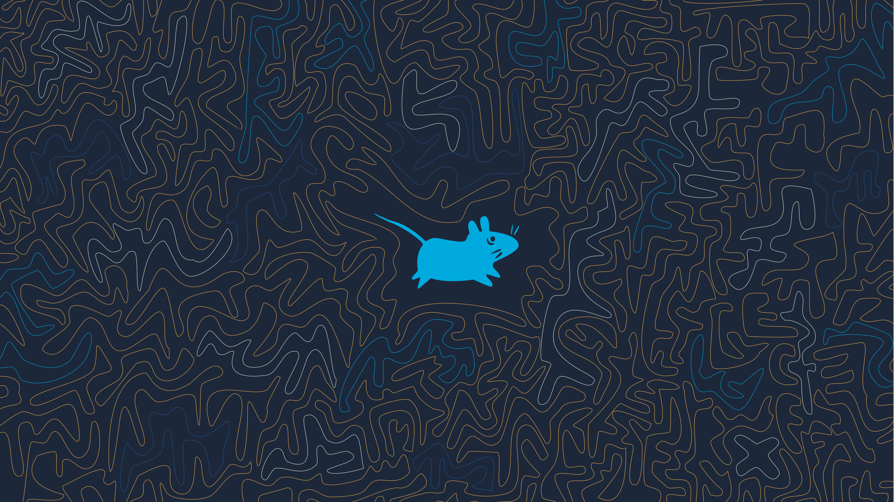
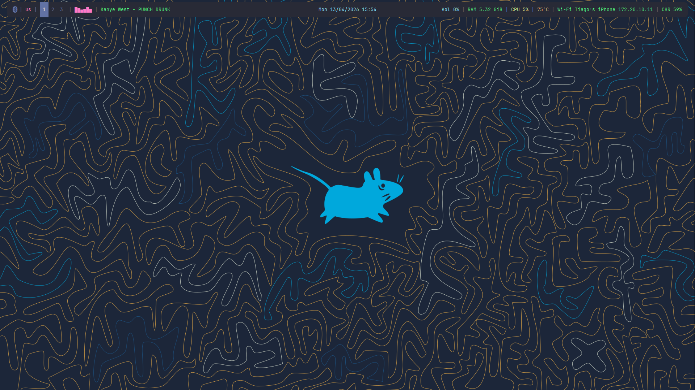
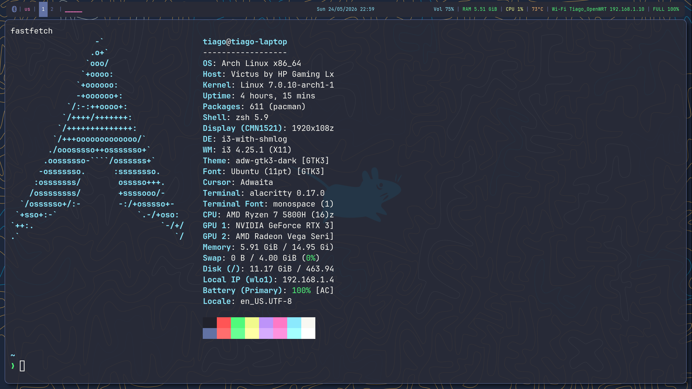
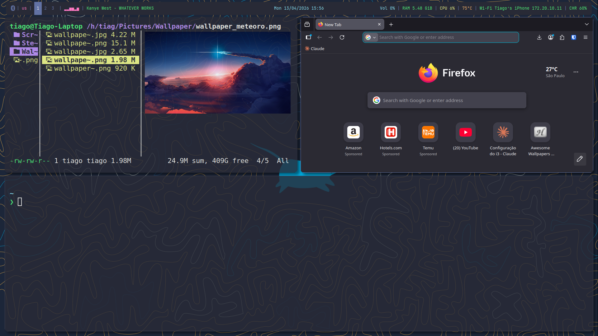

# Dotfiles

i3 rice on Arch Linux — Dracula theme throughout.



## What's Included

```
.config/
├── i3/config                  # i3 window manager
├── polybar/config.ini         # Status bar
├── polybar/launch.sh          # Polybar launch script
├── polybar/cava-polybar.sh    # Audio visualizer script
├── picom/picom.conf           # Compositor (rounded corners, opacity, shadows)
├── dunst/dunstrc              # Notifications
├── rofi/power-menu.sh         # Power menu (shutdown, reboot, suspend, lock, logout)
├── rofi/wifi-menu.sh          # Wi-Fi selector via rofi
├── rofi/config.rasi           # Rofi font config
├── alacritty/alacritty.toml   # Terminal (Dracula theme)
├── ranger/rc.conf             # File manager
├── ranger/scope.sh            # Ranger preview script
├── ranger/colorschemes/       # Dracula theme
├── ranger/plugins/            # Devicons
├── cava/polybar.conf          # Cava config for polybar visualizer
wallpapers/                    # Wallpaper(s)
```

## Screenshots





## Dependencies

### Arch Linux (pacman)

```
sudo pacman -S xorg i3-wm alacritty polybar picom dunst rofi feh scrot flameshot ranger brightnessctl playerctl cava blueman pavucontrol xdotool numlockx imagemagick bc lxappearance xorg-xinit wireless_tools inetutils openssh wget git zsh btop fastfetch ttf-jetbrains-mono-nerd adw-gtk-theme pipewire pipewire-pulse pipewire-alsa wireplumber bluez-utils xf86-video-amdgpu xf86-video-fbdev nvidia-open
```

### AUR (via yay)

```
yay -S autotiling betterlockscreen librewolf-bin
```

### Manual installs

- **greenclip** — download binary from [GitHub releases](https://github.com/erebe/greenclip/releases) to `~/.local/bin/`
- **Starship prompt** — `curl -sS https://starship.rs/install.sh | sh`

### Apps

```
sudo pacman -S firefox bitwarden discord zsh btop fastfetch gnome-calculator git curl wget openssh
yay -S pycharm-community-edition obsidian librewolf-bin spotify
```

## Installation

1. Clone the repo:
   ```
   git clone https://github.com/FernandesTiago/dotfiles.git ~/Github/dotfiles
   ```

2. Install dependencies (see above).

3. Copy configs:
   ```
   mkdir -p ~/.config
   cp -r ~/Github/dotfiles/.config/* ~/.config/
   mkdir -p ~/Pictures/Wallpaper
   cp ~/Github/dotfiles/wallpapers/* ~/Pictures/Wallpaper/
   ```

4. Setup greenclip:
   ```
   mkdir -p ~/.local/bin
   wget https://github.com/erebe/greenclip/releases/download/v4.2/greenclip -O ~/.local/bin/greenclip
   chmod +x ~/.local/bin/greenclip
   ```

5. Setup zsh + Starship:
   ```
   chsh -s /bin/zsh
   curl -sS https://starship.rs/install.sh | sh
   echo 'eval "$(starship init zsh)"' >> ~/.zshrc
   echo 'export PATH="$HOME/.local/bin:$PATH"' >> ~/.zshrc
   ```

6. Cache lock screen wallpaper:
   ```
   betterlockscreen -u ~/Pictures/Wallpaper/wallpaper_rato.png
   ```

7. Enable services:
   ```
   sudo systemctl enable sddm
   sudo systemctl enable bluetooth
   sudo systemctl enable NetworkManager
   ```

8. Reload i3: `Super+Shift+R`

## Keybinds

| Key | Action |
|-----|--------|
| Super+Return | Terminal (Alacritty) |
| Super+D | Rofi launcher |
| Super+F | LibreWolf |
| Super+Y | LibreWolf → YouTube |
| Super+E | Nemo |
| Super+R | Ranger |
| Super+A | Pavucontrol |
| Super+P | Power menu |
| Super+C | Clipboard history (Greenclip) |
| Super+L | Lock screen |
| Super+Shift+Q | Close window |
| F11 | Fullscreen |
| Super+Shift+F | Float toggle |
| Super+Arrows | Move focus |
| Super+Ctrl+Arrows | Move window |
| Super+S/W/T | Stack/Tab/Split layout |
| Super+Print | Screenshot to clipboard |
| Super+Shift+Print | Screenshot save to file |
| Print | Flameshot gui |
| Alt+Tab | Switch to last workspace |
| Alt+Shift | Toggle keyboard US/BR |

## Hardware

- HP Victus — Ryzen 7 5800H, RTX 3050 Ti (nvidia-open + amdgpu)
- Arch Linux + i3wm
- Display manager: SDDM

## Notes

- Volume controlled via `wpctl` (PipeWire native) with 150% limit
- Brightness via `brightnessctl` (user must be in `video` group)
- Keyboard layout toggle via setxkbmap in i3 config
- Wi-Fi managed via custom rofi script (click Wi-Fi module in polybar)
- Bluetooth icon uses Nerd Font with color toggle (on/off)
- Player module has maxlen 68 to prevent pushing other modules
- Greenclip requires `~/.local/bin` in PATH
- Migrated from Linux Mint 22.3 — dotfiles are cross-compatible with minor hardware adjustments (interface name, display output)
